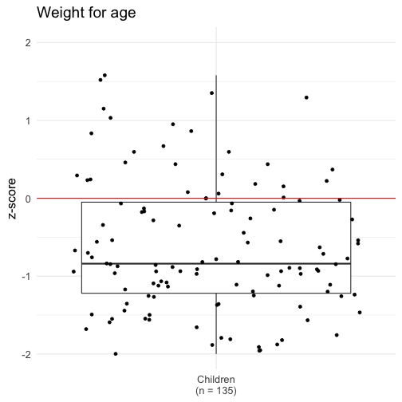
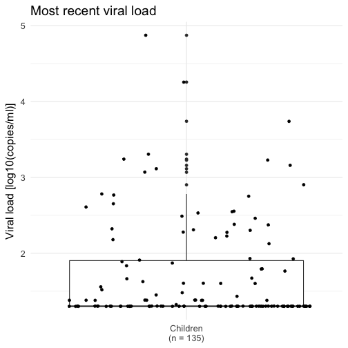

## Quick look at the data

```r
# 'Top-n-tail' data
head(data)
```

```
## # A tibble: 6 × 15
##       ID Date.of.assessment Date.of.birth    Sex   ART   WAZ   HAZ   CD4
##    <chr>             <date>        <date>  <chr> <chr> <dbl> <dbl> <int>
## 1 ID8120         2013-10-29    2008-09-13 Female   Yes -2.56 -2.28  1456
## 2 ID8078         2013-11-13    2008-05-26   Male   Yes -1.88 -2.31  1465
## 3 ID8076         2013-11-19    2007-01-08 Female   Yes -0.82 -1.89  1003
## 4 ID8093         2013-09-12    2008-08-09 Female   Yes -0.86 -2.80  1363
## 5 ID8177         2013-08-22    2008-05-23   Male   Yes -1.13 -3.12  1264
## 6 ID8190         2013-08-22    2008-08-18 Female   Yes  1.29 -0.05  1291
## # ... with 7 more variables: Viral.load <int>, ART.regimen <chr>,
## #   ART.start.age.years <int>, Age.start.age.months <int>, d4T.ever <chr>,
## #   Age.years <dbl>, ART.years <dbl>
```

```r
tail(data)
```

```
## # A tibble: 6 × 15
##       ID Date.of.assessment Date.of.birth    Sex   ART   WAZ   HAZ   CD4
##    <chr>             <date>        <date>  <chr> <chr> <dbl> <dbl> <int>
## 1 ID8147         2014-05-20    2008-04-11 Female   Yes -2.65 -2.76   881
## 2 ID8151         2015-06-11    2008-01-04   Male   Yes -1.11 -1.43   943
## 3 ID8161         2015-05-19    2009-12-10   Male   Yes -1.24 -0.79   721
## 4 ID8209         2015-04-08    2009-06-15   Male   Yes -0.19 -0.91   867
## 5 ID8111         2014-09-11    2008-07-09   Male   Yes -0.77 -1.60  1358
## 6 ID8220         2014-06-03    2008-09-16   Male   Yes -2.42 -2.33  1350
## # ... with 7 more variables: Viral.load <int>, ART.regimen <chr>,
## #   ART.start.age.years <int>, Age.start.age.months <int>, d4T.ever <chr>,
## #   Age.years <dbl>, ART.years <dbl>
```

```r
# Check structure
glimpse(data)
```

```
## Observations: 135
## Variables: 15
## $ ID                   <chr> "ID8120", "ID8078", "ID8076", "ID8093", "...
## $ Date.of.assessment   <date> 2013-10-29, 2013-11-13, 2013-11-19, 2013...
## $ Date.of.birth        <date> 2008-09-13, 2008-05-26, 2007-01-08, 2008...
## $ Sex                  <chr> "Female", "Male", "Female", "Female", "Ma...
## $ ART                  <chr> "Yes", "Yes", "Yes", "Yes", "Yes", "Yes",...
## $ WAZ                  <dbl> -2.56, -1.88, -0.82, -0.86, -1.13, 1.29, ...
## $ HAZ                  <dbl> -2.28, -2.31, -1.89, -2.80, -3.12, -0.05,...
## $ CD4                  <int> 1456, 1465, 1003, 1363, 1264, 1291, 111, ...
## $ Viral.load           <int> 189, 20, 20, 798, 20, 20, 20, 20, 20, 20,...
## $ ART.regimen          <chr> "3TC, ABC, EFV", "LPV/R, 3TC, D4T", "LPV/...
## $ ART.start.age.years  <int> 0, 0, 0, 0, 0, 0, 0, 0, 0, 0, 0, 0, 1, 0,...
## $ Age.start.age.months <int> 5, 3, 3, 3, 4, 4, 2, 6, 5, 5, 6, 3, 10, 1...
## $ d4T.ever             <chr> "Yes", "Yes", "Yes", "Yes", "Yes", "Yes",...
## $ Age.years            <dbl> 5.13, 5.47, 6.86, 5.09, 5.25, 5.01, 5.39,...
## $ ART.years            <dbl> 3.71, 4.22, 5.62, 3.84, 3.91, 3.68, 4.22,...
```

## Demographic data
### Sex

```r
# Summarise data
sex <- summary(factor(data$Sex))
sex <- c(sex, 
         round(nrow(data[data$Sex == 'Female', ]) / nrow(data) * 100))
sex <- data_frame(Female = sex[[1]],
                  Male = sex[[2]],
                  '% Female' = sex[[3]])

# Print summary
pander(sex, caption = 'Number of males and females')
```


--------------------------
 Female   Male   % Female 
-------- ------ ----------
   63      72       47    
--------------------------

Table: Number of males and females

### Age

```r
## Summarise data
age <- data %>%
    select(Age.years) %>%
    summarise(`Age (years)` = round(mean(Age.years), 1),
              SD = round(sd(Age.years), 1))

## Print summary
pander(age, caption = 'Mean age of the children')
```


------------------
 Age (years)   SD 
------------- ----
     6.9      1.7 
------------------

Table: Mean age of the children

```r
## Plot data
qplot(data$Age.years, 
      geom = c('boxplot', 'jitter'), 
      x = 'Children\n(n = 135)', 
      ylab = 'Years', 
      main = 'Age') +
    theme_minimal(base_size = 16) +
    theme(axis.title.x = element_blank())
```


### Weight for age 

```r
## Summarise data
waz <- summary(data$WAZ)

## Print summary table
pander(waz, caption = 'Weight for age (z-score)')
```


---------------------------------------------------------
 Min.   1st Qu.   Median   Mean    3rd Qu.   Max.   NA's 
------ --------- -------- ------- --------- ------ ------
-2.65   -1.448    -0.895  -0.7937  -0.145    1.58    3   
---------------------------------------------------------

Table: Weight for age (z-score)

```r
## Plot data
qplot(data$WAZ, 
      geom = c('boxplot', 'jitter'), 
      ylim = c(-2, 2), 
      x = 'Children\n(n = 135)', 
      ylab = 'z-score', 
      main = 'Weight for age') +
    geom_hline(yintercept = 0, colour = 'red') +
    theme_minimal(base_size = 16) +
    theme(axis.title.x = element_blank())
```



### Height for age 

```r
## Summarise data
haz <- summary(data$HAZ)

## Print summary table
pander(haz, caption = 'Height for age (z-score)')
```


--------------------------------------------------------
 Min.   1st Qu.   Median   Mean   3rd Qu.   Max.   NA's 
------ --------- -------- ------ --------- ------ ------
-3.27   -1.965    -1.32   -1.227  -0.4925   2.11    1   
--------------------------------------------------------

Table: Height for age (z-score)

```r
## Plot data 
qplot(data$HAZ, 
      geom = c('boxplot', 'jitter'), 
      ylim = c(-2, 2), 
      x = 'Children\n(n = 135)', 
      ylab = 'z-score', 
      main = 'Height for age') +
    geom_hline(yintercept = 0, colour = 'red') +
    theme_minimal(base_size = 16) +
    theme(axis.title.x = element_blank())
```


## Disease data
### Most recent CD4

```r
# Summarise data
cd4 <- summary(data$CD4)

## Print summary table
pander(cd4, caption = 'Most recent CD4 T-cell count (cells/mm3)')
```


--------------------------------------------------------
 Min.   1st Qu.   Median   Mean   3rd Qu.   Max.   NA's 
------ --------- -------- ------ --------- ------ ------
 111     927.5     1184    1213    1440     2808    1   
--------------------------------------------------------

Table: Most recent CD4 T-cell count (cells/mm3)

```r
## Plot data
qplot(data$CD4, 
      geom = c('boxplot', 'jitter'), 
      x = 'Children\n(n = 135)', 
      ylab = 'CD4 T-cell count (cells/mm3)', 
      main = 'Most recent CD4 T-cell count') +
    theme_minimal(base_size = 16) +
    theme(axis.title.x = element_blank())
```


### Most recent viral load

```r
## Summarise data
vl <- summary(log10(data$Viral.load))

## Print summary table
pander(vl, caption = 'Most recent viral load [log10(copies/ml)]')
```


--------------------------------------------------------
 Min.   1st Qu.   Median   Mean   3rd Qu.   Max.   NA's 
------ --------- -------- ------ --------- ------ ------
1.301    1.301    1.301   1.709    1.903   4.873    1   
--------------------------------------------------------

Table: Most recent viral load [log10(copies/ml)]

```r
## Plot data
qplot(log10(data$Viral.load), 
      geom = c('boxplot', 'jitter'), 
      x = 'Children\n(n = 135)', 
      ylab = 'Viral load [log10(copies/ml)]', 
      main = 'Most recent viral load') +
    theme_minimal(base_size = 16) +
    theme(axis.title.x = element_blank())
```



## Treatment data
### Current ART regimen

```r
## Get names for ordering factor
foo_names <- data %>%
    select(ART.regimen) %>%
    filter(!is.na(ART.regimen)) %>%
    group_by(ART.regimen) %>%
    summarise(foo_names = unique(ART.regimen)) %>%
    select(foo_names) %>%
    .$foo_names

## Get counts and arrange with NA last
foo <- data %>%
    mutate(ART.regimen = str_replace_na(ART.regimen)) %>%
    group_by(ART.regimen) %>%
    summarise(n = n()) %>%
    mutate(ART.regimen = factor(ART.regimen,
                                levels = c(foo_names, 'NA'),
                                ordered = TRUE)) %>%
    # Add percents
    ungroup() %>%
    mutate('%' = round(n / sum(n) * 100)) %>%
    arrange(desc(n))

## Print table
pander(foo, 
       caption = 'Current ART regimen',
       justify = 'lrr',
       split.tables = Inf)
```


-----------------------
ART.regimen       n   %
--------------- --- ---
3TC, ABC, EFV    40  30

NA               35  26

LPV/R, 3TC, ABC  33  24

LPV/R, 3TC, D4T  14  10

3TC, D4T, EFV    10   7

LPV/R, 3TC, AZT   2   1

LPV/R, 3TC        1   1
-----------------------

Table: Current ART regimen

### D4T ever

```r
## Get counts and arrange with NA last
bar <- data %>%
    mutate(d4T.ever = str_replace_na(d4T.ever)) %>%
    group_by(d4T.ever) %>%
    summarise(n = n()) %>%
    mutate(d4T.ever = factor(d4T.ever,
                             levels = c('Yes', 'No', 'NA'),
                             ordered = TRUE)) %>%
    # Add percents
    ungroup() %>%
    mutate('%' = round(n / sum(n) * 100)) %>%
    arrange(d4T.ever)

## Print table
pander(bar, 
       caption = 'd4T use: ever',
       justify = 'lrr',
       split.tables = Inf)
```


------------------
d4T.ever     n   %
---------- --- ---
Yes        127  94

No           6   4

NA           2   1
------------------

Table: d4T use: ever

### Currently on d4T

```r
## Process data
baz <- data %>%
    select(ART.regimen, d4T.ever) %>%
    mutate(ART.regimen = str_replace_na(ART.regimen),
           d4T.ever = str_replace_na(d4T.ever)) %>%
    mutate(d4T.now = ifelse(str_detect(ART.regimen, 
                                       pattern = 'D4T') == TRUE,
                            'Yes', ifelse(str_detect(ART.regimen, 
                                                     pattern = 'NA') == TRUE,
                                          'NA', 'No'))) 

## Get counts and arrange with NA last
baz2 <- baz %>%
    group_by(d4T.now) %>%
    summarise(n = n()) %>%
    mutate(d4T.now = factor(d4T.now,
                            levels = c('Yes', 'No', 'NA'),
                            ordered = TRUE)) %>%
    arrange(d4T.now) %>%
    # Add percents
    ungroup() %>%
    mutate('%' = round(n / sum(n) * 100)) %>%
    arrange(d4T.now)

## Print table
pander(baz2, 
       caption = 'd4T use: current',
       justify = 'lrr',
       split.tables = Inf)
```


-----------------
d4T.now     n   %
--------- --- ---
Yes        24  18

No         76  56

NA         35  26
-----------------

Table: d4T use: current

### Previous D4T use

```r
## Get counts and arrange with NA last
cux <- baz %>%
    mutate(d4T.previous = ifelse(c(d4T.ever == 'Yes' & d4T.now == 'No'),
                            'Yes', ifelse(d4T.now == 'No',
                                          'No', 'NA'))) %>%
    group_by(d4T.previous) %>%
    summarise(n = n()) %>%
    mutate(d4T.previous = factor(d4T.previous, 
                                 levels = c('Yes', 'No', 'NA'),
                                 ordered = TRUE)) %>%
    arrange(d4T.previous) %>%
    # Add percents
    ungroup() %>%
    mutate('%' = round(n / sum(n) * 100)) %>%
    arrange(d4T.previous)

## Print table
pander(cux, 
       caption = 'd4T use: previous', 
       justify = 'lrr',
       split.tables = Inf)
```


----------------------
d4T.previous     n   %
-------------- --- ---
Yes             70  52

No               6   4

NA              59  44
----------------------

Table: d4T use: previous

## Session infomation
**R version 3.3.3 (2017-03-06)**

**Platform:** x86_64-apple-darwin13.4.0 (64-bit) 

**locale:**
en_GB.UTF-8||en_GB.UTF-8||en_GB.UTF-8||C||en_GB.UTF-8||en_GB.UTF-8

**attached base packages:** 
_stats_, _graphics_, _grDevices_, _utils_, _datasets_ and _base_

**other attached packages:** 
_pander(v.0.6.0)_, _stringr(v.1.2.0)_, _ggplot2(v.2.2.1)_, _readr(v.1.1.0)_, _tidyr(v.0.6.1)_ and _dplyr(v.0.5.0)_

**loaded via a namespace (and not attached):** 
_Rcpp(v.0.12.10)_, _knitr(v.1.15.1)_, _magrittr(v.1.5)_, _hms(v.0.3)_, _munsell(v.0.4.3)_, _colorspace(v.1.3-2)_, _R6(v.2.2.0)_, _highr(v.0.6)_, _plyr(v.1.8.4)_, _tools(v.3.3.3)_, _grid(v.3.3.3)_, _packrat(v.0.4.8-1)_, _gtable(v.0.2.0)_, _R.oo(v.1.21.0)_, _DBI(v.0.6-1)_, _lazyeval(v.0.2.0)_, _assertthat(v.0.2.0)_, _digest(v.0.6.12)_, _tibble(v.1.3.0)_, _ezknitr(v.0.6)_, _codetools(v.0.2-15)_, _R.utils(v.2.5.0)_, _evaluate(v.0.10)_, _labeling(v.0.3)_, _stringi(v.1.1.5)_, _methods(v.3.3.3)_, _scales(v.0.4.1)_ and _R.methodsS3(v.1.7.1)_
