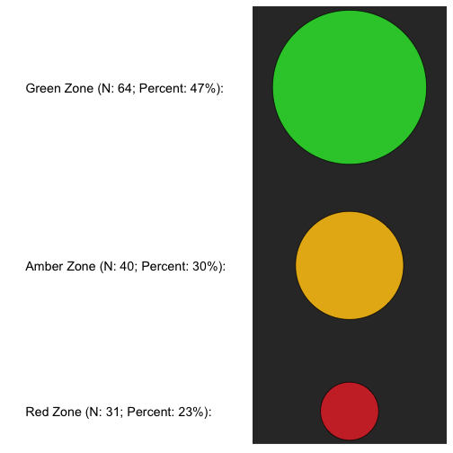

## Quick look

**Data are reported as age-adjusted percentile scores**


```r
# 'Top-n-tail' data
head(data)
```

```
## # A tibble: 6 × 34
##       ID MABC.manual.dex.percentile MABC.throw.percentile
##    <chr>                      <dbl>                 <dbl>
## 1 ID8120                         37                     2
## 2 ID8078                         63                    91
## 3 ID8076                         50                    84
## 4 ID8093                         37                    63
## 5 ID8177                          1                     9
## 6 ID8190                          2                    50
## # ... with 31 more variables: MABC.balance.percentile <dbl>,
## #   MABC.total.percentile <dbl>, MABC.zone <chr>, manual.dex.5th <chr>,
## #   manual.dex.10th <chr>, manual.dex.25th <chr>, manual.dex.50th <chr>,
## #   manual.dex.75th <chr>, manual.dex.95th <chr>, manual.dex.99th <chr>,
## #   throw.5th <chr>, throw.10th <chr>, throw.25th <chr>, throw.50th <chr>,
## #   throw.75th <chr>, throw.95th <chr>, throw.99th <chr>,
## #   balance.5th <chr>, balance.10th <chr>, balance.25th <chr>,
## #   balance.50th <chr>, balance.75th <chr>, balance.95th <chr>,
## #   balance.99th <chr>, total.5th <chr>, total.10th <chr>,
## #   total.25th <chr>, total.50th <chr>, total.75th <chr>,
## #   total.95th <chr>, total.99th <chr>
```

```r
tail(data)
```

```
## # A tibble: 6 × 34
##       ID MABC.manual.dex.percentile MABC.throw.percentile
##    <chr>                      <dbl>                 <dbl>
## 1 ID8147                          9                    25
## 2 ID8151                          2                    37
## 3 ID8161                         16                    98
## 4 ID8209                         25                    63
## 5 ID8111                          9                    75
## 6 ID8220                          2                    25
## # ... with 31 more variables: MABC.balance.percentile <dbl>,
## #   MABC.total.percentile <dbl>, MABC.zone <chr>, manual.dex.5th <chr>,
## #   manual.dex.10th <chr>, manual.dex.25th <chr>, manual.dex.50th <chr>,
## #   manual.dex.75th <chr>, manual.dex.95th <chr>, manual.dex.99th <chr>,
## #   throw.5th <chr>, throw.10th <chr>, throw.25th <chr>, throw.50th <chr>,
## #   throw.75th <chr>, throw.95th <chr>, throw.99th <chr>,
## #   balance.5th <chr>, balance.10th <chr>, balance.25th <chr>,
## #   balance.50th <chr>, balance.75th <chr>, balance.95th <chr>,
## #   balance.99th <chr>, total.5th <chr>, total.10th <chr>,
## #   total.25th <chr>, total.50th <chr>, total.75th <chr>,
## #   total.95th <chr>, total.99th <chr>
```

```r
# Check structure
glimpse(data)
```

```
## Observations: 135
## Variables: 34
## $ ID                         <chr> "ID8120", "ID8078", "ID8076", "ID80...
## $ MABC.manual.dex.percentile <dbl> 37.0, 63.0, 50.0, 37.0, 1.0, 2.0, 0...
## $ MABC.throw.percentile      <dbl> 2, 91, 84, 63, 9, 50, 9, 75, 50, 37...
## $ MABC.balance.percentile    <dbl> 50, 37, 91, 50, 5, 50, 16, 9, 95, 5...
## $ MABC.total.percentile      <dbl> 16, 75, 84, 50, 1, 16, 1, 9, 37, 16...
## $ MABC.zone                  <chr> "Amber", "Green", "Green", "Green",...
## $ manual.dex.5th             <chr> "no", "no", "no", "no", "yes", "yes...
## $ manual.dex.10th            <chr> "no", "no", "no", "no", "yes", "yes...
## $ manual.dex.25th            <chr> "no", "no", "no", "no", "yes", "yes...
## $ manual.dex.50th            <chr> "yes", "no", "yes", "yes", "yes", "...
## $ manual.dex.75th            <chr> "yes", "yes", "yes", "yes", "yes", ...
## $ manual.dex.95th            <chr> "yes", "yes", "yes", "yes", "yes", ...
## $ manual.dex.99th            <chr> "yes", "yes", "yes", "yes", "yes", ...
## $ throw.5th                  <chr> "yes", "no", "no", "no", "no", "no"...
## $ throw.10th                 <chr> "yes", "no", "no", "no", "yes", "no...
## $ throw.25th                 <chr> "yes", "no", "no", "no", "yes", "no...
## $ throw.50th                 <chr> "yes", "no", "no", "no", "yes", "ye...
## $ throw.75th                 <chr> "yes", "no", "no", "yes", "yes", "y...
## $ throw.95th                 <chr> "yes", "yes", "yes", "yes", "yes", ...
## $ throw.99th                 <chr> "yes", "yes", "yes", "yes", "yes", ...
## $ balance.5th                <chr> "no", "no", "no", "no", "yes", "no"...
## $ balance.10th               <chr> "no", "no", "no", "no", "yes", "no"...
## $ balance.25th               <chr> "no", "no", "no", "no", "yes", "no"...
## $ balance.50th               <chr> "yes", "yes", "no", "yes", "yes", "...
## $ balance.75th               <chr> "yes", "yes", "no", "yes", "yes", "...
## $ balance.95th               <chr> "yes", "yes", "yes", "yes", "yes", ...
## $ balance.99th               <chr> "yes", "yes", "yes", "yes", "yes", ...
## $ total.5th                  <chr> "no", "no", "no", "no", "yes", "no"...
## $ total.10th                 <chr> "no", "no", "no", "no", "yes", "no"...
## $ total.25th                 <chr> "yes", "no", "no", "no", "yes", "ye...
## $ total.50th                 <chr> "yes", "no", "no", "yes", "yes", "y...
## $ total.75th                 <chr> "yes", "yes", "no", "yes", "yes", "...
## $ total.95th                 <chr> "yes", "yes", "yes", "yes", "yes", ...
## $ total.99th                 <chr> "yes", "yes", "yes", "yes", "yes", ...
```

## Performance domains

### Boot function

```r
############################################################
#                                                          #
#                      Boot functions                      #
#                                                          #
############################################################
# Use package 'boot' to bootstrap 95%CI of percent children in specified percentiles
mabc <- function(data, i) {
    dat <- data[i]
    dat_percent <- round(sum(dat == 'yes', rm.na = TRUE) / length(dat) * 100, 1)
    return(dat_percent)
}
```

### Dexterity

```r
# Complete cases
data_dex <- data[!is.na(data$MABC.manual.dex.percentile), ]
nrow(data_dex)
```

```
## [1] 135
```

```r
# Exploratory plot
qplot(data = data, y = MABC.manual.dex.percentile, x = '', 
      geom = c('boxplot', 'jitter'), ylim = c(0, 100),
      main = 'MABC manual dexterity', 
      ylab = 'Performance (percentile)\n') +
    scale_y_continuous(breaks = c(5, 10, 25, 50, 75, 95),
                       labels = c(5, 10, 25, 50, 75, 95)) +
    # Add percentiles
    geom_hline(yintercept = 5, colour = pal[[2]]) +
    geom_hline(yintercept = 10, colour = pal[[3]]) +
    geom_hline(yintercept = 25, colour = pal[[4]]) +
    geom_hline(yintercept = 50, colour = pal[[5]]) +
    geom_hline(yintercept = 75, colour = pal[[6]]) +
    geom_hline(yintercept = 95, colour = pal[[7]]) +
    theme_minimal(base_size = 14) +
    theme(panel.grid = element_blank(),
          axis.title.x = element_blank())
```


```r
# Summary table
dex_tab <- data %>%
    select(ID, 
           starts_with('manual.dex')) %>%
    gather(key = Percentile,
           value = Present,
           -ID) %>%
    separate(col = Percentile, 
             into = c('extra', 'extra2', 'Percentile'),
             sep = '\\.') %>%
    select(-starts_with('extra')) %>%
    group_by(Percentile, Present) %>%
    summarise(`Cumulative count` = n(),
              `Cumulative percent` = round(sum(Present == 'yes') / nrow(data) * 100, 1)) %>%
    ungroup() %>%
    filter(Present == 'yes') %>%
    select(Percentile, `Cumulative count`, `Cumulative percent`) %>%
    mutate(Percentile = 
               fct_relevel(Percentile,
                           '5th', '10th', '25th', '50th', '75th', '95th', '99th')) %>%
    arrange(Percentile) %>%
    mutate(Percentile = as.character(Percentile))

# Bootstrap
dex_boot <- data %>%
    select(starts_with('manual.dex')) %>%
    # Apply bootstrap function
    map(~boot(., statistic = mabc, R = 1000)) %>%
    # Generate CI
    map(~boot.ci(., type = 'basic')) %>%
    # Remove NULL elements
    .[sapply(., Negate(is.null))] %>%
    as_data_frame() %>%
    # Extract CI
    dmap(~paste(round(.$basic[4], 1), ' to ', round(.$basic[5], 1))) %>%
    # Get ready for join
    gather(key = Percentile,
           value = '95% CI') %>%
    separate(col = Percentile, 
             into = c('extra', 'extra2', 'Percentile'),
             sep = '\\.') %>%
    select(-starts_with('extra')) %>%
    mutate(Percentile = 
               fct_relevel(Percentile,
                           '5th', '10th', '25th', '50th', '75th', '95th', '99th')) %>%
    arrange(Percentile) %>%
    mutate(Percentile = as.character(Percentile)) %>%
    # Fix maths > 100% issue
    mutate(`95% CI` = str_replace(`95% CI`,
                                  pattern = '10*.*$',
                                  replacement = '100.0'))
```

```
## [1] "All values of t are equal to  100.7 \n Cannot calculate confidence intervals"
## [1] "All values of t are equal to  100.7 \n Cannot calculate confidence intervals"
## [1] "All values of t are equal to  100.7 \n Cannot calculate confidence intervals"
```

```r
# Join
dex_tab <- dex_tab %>%
    left_join(dex_boot, by = 'Percentile')

# Table
pander(dex_tab, 
       caption = 'MABC manual dexterity performance', 
       justify = 'lrrr')
```


------------------------------------------------------------------
Percentile     Cumulative count   Cumulative percent        95% CI
------------ ------------------ -------------------- -------------
5th                          74                 54.8  47.5 to 63.8

10th                         96                 71.1  64.5 to 79.4

25th                        122                 90.4  86.6 to 96.3

50th                        132                 97.8 96.3 to 100.0

75th                        135                100.0            NA

95th                        135                100.0            NA

99th                        135                100.0            NA
------------------------------------------------------------------

Table: MABC manual dexterity performance

### Balance

```r
# Complete cases
data_balance <- data[!is.na(data$MABC.balance.percentile), ]
nrow(data_balance)
```

```
## [1] 135
```

```r
# Exploratory plot
qplot(data = data, y = MABC.balance.percentile, x = '', 
      geom = c('boxplot', 'jitter'), ylim = c(0, 100),
      main = 'MABC balance', 
      ylab = 'Performance (percentile)\n') +
    scale_y_continuous(breaks = c(5, 10, 25, 50, 75, 95),
                       labels = c(5, 10, 25, 50, 75, 95)) +
    # Add percentiles
    geom_hline(yintercept = 5, colour = pal[[2]]) +
    geom_hline(yintercept = 10, colour = pal[[3]]) +
    geom_hline(yintercept = 25, colour = pal[[4]]) +
    geom_hline(yintercept = 50, colour = pal[[5]]) +
    geom_hline(yintercept = 75, colour = pal[[6]]) +
    geom_hline(yintercept = 95, colour = pal[[7]]) +
    theme_minimal(base_size = 14) +
    theme(panel.grid = element_blank(),
          axis.title.x = element_blank())
```


```r
# Summary table
balance_tab <- data %>%
    select(ID, 
           starts_with('balance')) %>%
    gather(key = Percentile,
           value = Present,
           -ID) %>%
    separate(col = Percentile, 
             into = c('extra', 'Percentile'),
             sep = '\\.') %>%
    select(-extra) %>%
    group_by(Percentile, Present) %>%
    summarise(`Cumulative count` = n(),
              `Cumulative percent` = round(sum(Present == 'yes') / nrow(data) * 100, 1)) %>%
    ungroup() %>%
    filter(Present == 'yes') %>%
    select(Percentile, `Cumulative count`, `Cumulative percent`) %>%
    mutate(Percentile = 
               fct_relevel(Percentile,
                           '5th', '10th', '25th', '50th', '75th', '95th', '99th')) %>%
    arrange(Percentile) %>%
    mutate(Percentile = as.character(Percentile))

# Bootstrap
balance_boot <- data %>%
    select(starts_with('balance')) %>%
    # Apply bootstrap function
    map(~boot(., statistic = mabc, R = 1000)) %>%
    # Generate CI
    map(~boot.ci(., type = 'basic')) %>%
    # Remove NULL elements
    .[sapply(., Negate(is.null))] %>%
    as_data_frame() %>%
    # Extract CI
    dmap(~paste(round(.$basic[4], 1), ' to ', round(.$basic[5], 1))) %>%
    # Get ready for join
    gather(key = Percentile,
           value = '95% CI') %>%
    separate(col = Percentile, 
             into = c('extra', 'Percentile'),
             sep = '\\.') %>%
    select(-extra) %>%
    mutate(Percentile = 
               fct_relevel(Percentile,
                           '5th', '10th', '25th', '50th', '75th', '95th', '99th')) %>%
    arrange(Percentile) %>%
    mutate(Percentile = as.character(Percentile)) %>%
    # Fix maths > 100% issue
    mutate(`95% CI` = str_replace(`95% CI`,
                                  pattern = '10[0-9]\\.[0-9]',
                                  replacement = '100.0'))

# Join
balance_tab <- balance_tab %>%
    left_join(balance_boot, by = 'Percentile')

pander(balance_tab, 
       caption = 'MABC Balance performance', 
       justify = 'lrrr')
```


------------------------------------------------------------------
Percentile     Cumulative count   Cumulative percent        95% CI
------------ ------------------ -------------------- -------------
5th                          15                 11.1   6.8 to 17.1

10th                         21                 15.6   9.6 to 22.2

25th                         39                 28.9    21.4 to 37

50th                         74                 54.8  47.5 to 63.8

75th                         95                 70.4  63.7 to 78.5

95th                        124                 91.9  88.2 to 97.1

99th                        134                 99.3 99.3 to 100.0
------------------------------------------------------------------

Table: MABC Balance performance

### Throwing

```r
# Complete cases
data_throw <- data[!is.na(data$MABC.throw.percentile), ]
nrow(data_throw)
```

```
## [1] 135
```

```r
# Exploratory plot
qplot(data = data, y = MABC.throw.percentile, x = '', 
      geom = c('boxplot', 'jitter'), ylim = c(0, 100),
      main = 'MABC throwing', 
      ylab = 'Performance (percentile)\n') +
    scale_y_continuous(breaks = c(5, 10, 25, 50, 75, 95),
                       labels = c(5, 10, 25, 50, 75, 95)) +
    # Add percentiles
    geom_hline(yintercept = 5, colour = pal[[2]]) +
    geom_hline(yintercept = 10, colour = pal[[3]]) +
    geom_hline(yintercept = 25, colour = pal[[4]]) +
    geom_hline(yintercept = 50, colour = pal[[5]]) +
    geom_hline(yintercept = 75, colour = pal[[6]]) +
    geom_hline(yintercept = 95, colour = pal[[7]]) +
    theme_minimal(base_size = 14) +
    theme(panel.grid = element_blank(),
          axis.title.x = element_blank())
```


```r
# Summary table
throw_tab <- data %>%
    select(ID, 
           starts_with('throw')) %>%
    gather(key = Percentile,
           value = Present,
           -ID) %>%
    separate(col = Percentile, 
             into = c('extra', 'Percentile'),
             sep = '\\.') %>%
    select(-extra) %>%
    group_by(Percentile, Present) %>%
    summarise(`Cumulative count` = n(),
              `Cumulative percent` = round(sum(Present == 'yes') / nrow(data) * 100, 1)) %>%
    ungroup() %>%
    filter(Present == 'yes') %>%
    select(Percentile, `Cumulative count`, `Cumulative percent`) %>%
    mutate(Percentile = 
               fct_relevel(Percentile,
                           '5th', '10th', '25th', '50th', '75th', '95th', '99th')) %>%
    arrange(Percentile) %>%
    mutate(Percentile = as.character(Percentile))

# Bootstrap
throw_boot <- data %>%
    select(starts_with('throw')) %>%
    # Apply bootstrap function
    map(~boot(., statistic = mabc, R = 1000)) %>%
    # Generate CI
    map(~boot.ci(., type = 'basic')) %>%
    # Remove NULL elements
    .[sapply(., Negate(is.null))] %>%
    as_data_frame() %>%
    # Extract CI
    dmap(~paste(round(.$basic[4], 1), ' to ', round(.$basic[5], 1))) %>%
    # Get ready for join
    gather(key = Percentile,
           value = '95% CI') %>%
    separate(col = Percentile, 
             into = c('extra', 'Percentile'),
             sep = '\\.') %>%
    select(-extra) %>%
    mutate(Percentile = 
               fct_relevel(Percentile,
                           '5th', '10th', '25th', '50th', '75th', '95th', '99th')) %>%
    arrange(Percentile) %>%
    mutate(Percentile = as.character(Percentile)) %>%
    # Fix maths > 100% issue
    mutate(`95% CI` = str_replace(`95% CI`,
                                  pattern = '10[0-9]\\.[0-9]',
                                  replacement = '100.0'))

# Join
throw_tab <- throw_tab %>%
    left_join(throw_boot, by = 'Percentile')


pander(throw_tab, 
       caption = 'MABC throwing performance', 
       justify = 'lrrr')
```


------------------------------------------------------------------
Percentile     Cumulative count   Cumulative percent        95% CI
------------ ------------------ -------------------- -------------
5th                          16                 11.9   7.4 to 17.8

10th                         24                 17.8  11.8 to 24.4

25th                         62                 45.9  38.6 to 54.9

50th                        101                 74.8  68.2 to 83.8

75th                        124                 91.9  88.2 to 97.1

95th                        131                 97.0 95.6 to 100.0

99th                        134                 99.3 99.3 to 100.0
------------------------------------------------------------------

Table: MABC throwing performance

### Overall

```r
# Complete cases
data_total <- data[!is.na(data$MABC.total.percentile), ]
nrow(data_total)
```

```
## [1] 135
```

```r
# Exploratory plot
qplot(data = data, y = MABC.total.percentile, x = '', 
      geom = c('boxplot', 'jitter'), ylim = c(0, 100),
      main = 'MABC total', 
      ylab = 'Performance (percentile)\n') +
    scale_y_continuous(breaks = c(5, 10, 25, 50, 75, 95),
                       labels = c(5, 10, 25, 50, 75, 95)) +
    # Add percentiles
    geom_hline(yintercept = 5, colour = pal[[2]]) +
    geom_hline(yintercept = 10, colour = pal[[3]]) +
    geom_hline(yintercept = 25, colour = pal[[4]]) +
    geom_hline(yintercept = 50, colour = pal[[5]]) +
    geom_hline(yintercept = 75, colour = pal[[6]]) +
    geom_hline(yintercept = 95, colour = pal[[7]]) +
    theme_minimal(base_size = 14) +
    theme(panel.grid = element_blank(),
          axis.title.x = element_blank())
```


```r
# Summary table
total_tab <- data %>%
    select(ID, 
           starts_with('total')) %>%
    gather(key = Percentile,
           value = Present,
           -ID) %>%
    separate(col = Percentile, 
             into = c('extra', 'Percentile'),
             sep = '\\.') %>%
    select(-extra) %>%
    group_by(Percentile, Present) %>%
    summarise(`Cumulative count` = n(),
              `Cumulative percent` = round(sum(Present == 'yes') / nrow(data) * 100, 1)) %>%
    ungroup() %>%
    filter(Present == 'yes') %>%
    select(Percentile, `Cumulative count`, `Cumulative percent`) %>%
    mutate(Percentile = 
               fct_relevel(Percentile,
                           '5th', '10th', '25th', '50th', '75th', '95th', '99th')) %>%
    arrange(Percentile) %>%
    mutate(Percentile = as.character(Percentile))

# Bootstrap
total_boot <- data %>%
    select(starts_with('total')) %>%
    # Apply bootstrap function
    map(~boot(., statistic = mabc, R = 1000)) %>%
    # Generate CI
    map(~boot.ci(., type = 'basic')) %>%
    # Remove NULL elements
    .[sapply(., Negate(is.null))] %>%
    as_data_frame() %>%
    # Extract CI
    dmap(~paste(round(.$basic[4], 1), ' to ', round(.$basic[5], 1))) %>%
    # Get ready for join
    gather(key = Percentile,
           value = '95% CI') %>%
    separate(col = Percentile, 
             into = c('extra', 'Percentile'),
             sep = '\\.') %>%
    select(-extra) %>%
    mutate(Percentile = 
               fct_relevel(Percentile,
                           '5th', '10th', '25th', '50th', '75th', '95th', '99th')) %>%
    arrange(Percentile) %>%
    mutate(Percentile = as.character(Percentile)) %>%
    # Fix maths > 100% issue
    mutate(`95% CI` = str_replace(`95% CI`,
                                  pattern = '10[0-9]\\.[0-9]',
                                  replacement = '100.0'))
```

```
## [1] "All values of t are equal to  100.7 \n Cannot calculate confidence intervals"
## [1] "All values of t are equal to  100.7 \n Cannot calculate confidence intervals"
```

```r
# Join
total_tab <- total_tab %>%
    left_join(total_boot, by = 'Percentile')


pander(total_tab, 
       caption = 'MABC total performance', 
       justify = 'lrrr')
```


------------------------------------------------------------------
Percentile     Cumulative count   Cumulative percent        95% CI
------------ ------------------ -------------------- -------------
5th                          31                 23.0  16.3 to 30.4

10th                         53                 39.3  31.9 to 48.1

25th                         94                 69.6    63 to 78.6

50th                        123                 91.1  87.5 to 97.1

75th                        131                 97.0 95.6 to 100.0

95th                        135                100.0            NA

99th                        135                100.0            NA
------------------------------------------------------------------

Table: MABC total performance

### Traffic light

```r
traffic_plot <- data %>%
    select(MABC.zone) %>%
    group_by(MABC.zone) %>%
    summarise(n = n(),
              percent = round(100 * (n / nrow(.)), 1)) %>%
    arrange(desc(n)) %>%
    mutate(Zone = fct_inorder(c('Green', 'Amber', 'Red'))) %>%
    select(Zone, n, percent) %>%
    add_column(x_value = c(5, 5, 5)) %>%
    add_column(x_value_text = c(1, 1, 1)) %>%
    add_column(y_values = c(2, 1.45, 1)) %>%
    add_column(text = sprintf('%s Zone (N: %d; Percent: %.0f%%):', 
                           .$Zone, .$n, .$percent)) 

ggplot(data = traffic_plot) +
    aes(x = x_value, y = y_values, fill = Zone, size = percent) +
    geom_rect(xmin = 3.8, xmax = 6.2, ymin = 0.9, ymax = 2.25, fill = '#323232') +
    geom_point(shape = 21) +
    geom_text(aes(x = x_value_text, label = text), size = 5, hjust = 'left') +
    scale_y_continuous(limits = c(0.9, 2.25), expand = c(0,0)) +
    scale_x_continuous(limits = c(0.8, 6.2), expand = c(0,0)) +
    scale_size_continuous(range = c(30, 80)) +
    scale_fill_manual(values = c('#2dc937', '#e7b416', '#cc3232')) +
    theme_minimal(base_size = 14) +
    theme(legend.position = 'none',
          axis.title = element_blank(),
          axis.text = element_blank(),
          panel.grid = element_blank())
```



## Session infomation
**R version 3.3.3 (2017-03-06)**

**Platform:** x86_64-apple-darwin13.4.0 (64-bit) 

**locale:**
en_GB.UTF-8||en_GB.UTF-8||en_GB.UTF-8||C||en_GB.UTF-8||en_GB.UTF-8

**attached base packages:** 
_stats_, _graphics_, _grDevices_, _utils_, _datasets_ and _base_

**other attached packages:** 
_boot(v.1.3-18)_, _pander(v.0.6.0)_, _scales(v.0.4.1)_, _ggplot2(v.2.2.1)_, _forcats(v.0.2.0)_, _readr(v.1.1.0)_, _stringr(v.1.2.0)_, _tibble(v.1.3.0)_, _tidyr(v.0.6.1)_, _dplyr(v.0.5.0)_ and _purrr(v.0.2.2)_

**loaded via a namespace (and not attached):** 
_Rcpp(v.0.12.10)_, _knitr(v.1.15.1)_, _magrittr(v.1.5)_, _hms(v.0.3)_, _munsell(v.0.4.3)_, _colorspace(v.1.3-2)_, _R6(v.2.2.0)_, _highr(v.0.6)_, _plyr(v.1.8.4)_, _tools(v.3.3.3)_, _grid(v.3.3.3)_, _packrat(v.0.4.8-1)_, _gtable(v.0.2.0)_, _R.oo(v.1.21.0)_, _DBI(v.0.6-1)_, _lazyeval(v.0.2.0)_, _assertthat(v.0.2.0)_, _digest(v.0.6.12)_, _RColorBrewer(v.1.1-2)_, _ezknitr(v.0.6)_, _codetools(v.0.2-15)_, _R.utils(v.2.5.0)_, _evaluate(v.0.10)_, _labeling(v.0.3)_, _stringi(v.1.1.5)_, _methods(v.3.3.3)_ and _R.methodsS3(v.1.7.1)_

