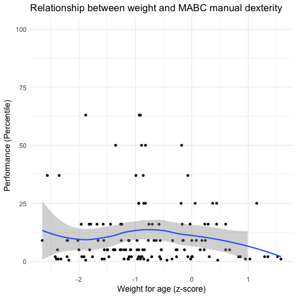

## Quick look at the data

```r
# 'Top-n-tail' data
head(data)
```

```
## # A tibble: 6 × 23
##       ID Neuropathy Neuropathy_pin    Sex   WAZ   HAZ   CD4 Viral.load
##    <chr>      <chr>          <chr>  <chr> <dbl> <dbl> <int>      <int>
## 1 ID8120        Yes            Yes Female -2.56 -2.28  1456        189
## 2 ID8078         No             No   Male -1.88 -2.31  1465         20
## 3 ID8076         No             No Female -0.82 -1.89  1003         20
## 4 ID8093         No             No Female -0.86 -2.80  1363        798
## 5 ID8177         No             No   Male -1.13 -3.12  1264         20
## 6 ID8190         No             No Female  1.29 -0.05  1291         20
## # ... with 15 more variables: MABC.zone <chr>, dexterity <dbl>,
## #   throwing <dbl>, balance <dbl>, total <dbl>, previous.pain <chr>,
## #   current.pain <chr>, pins.n.needles <chr>, numbness <chr>,
## #   reduced.vibration <chr>, reduced.reflex <chr>, cramping <chr>,
## #   itch <chr>, painful.cold <chr>, reduced.pinprick <chr>
```

```r
tail(data)
```

```
## # A tibble: 6 × 23
##       ID Neuropathy Neuropathy_pin    Sex   WAZ   HAZ   CD4 Viral.load
##    <chr>      <chr>          <chr>  <chr> <dbl> <dbl> <int>      <int>
## 1 ID8147         No             No Female -2.65 -2.76   881         20
## 2 ID8151        Yes            Yes   Male -1.11 -1.43   943         20
## 3 ID8161         No            Yes   Male -1.24 -0.79   721         20
## 4 ID8209         No             No   Male -0.19 -0.91   867         20
## 5 ID8111        Yes            Yes   Male -0.77 -1.60  1358         85
## 6 ID8220         No             No   Male -2.42 -2.33  1350         28
## # ... with 15 more variables: MABC.zone <chr>, dexterity <dbl>,
## #   throwing <dbl>, balance <dbl>, total <dbl>, previous.pain <chr>,
## #   current.pain <chr>, pins.n.needles <chr>, numbness <chr>,
## #   reduced.vibration <chr>, reduced.reflex <chr>, cramping <chr>,
## #   itch <chr>, painful.cold <chr>, reduced.pinprick <chr>
```

```r
# Check structure
glimpse(data)
```

```
## Observations: 135
## Variables: 23
## $ ID                <chr> "ID8120", "ID8078", "ID8076", "ID8093", "ID8...
## $ Neuropathy        <chr> "Yes", "No", "No", "No", "No", "No", "No", "...
## $ Neuropathy_pin    <chr> "Yes", "No", "No", "No", "No", "No", "Yes", ...
## $ Sex               <chr> "Female", "Male", "Female", "Female", "Male"...
## $ WAZ               <dbl> -2.56, -1.88, -0.82, -0.86, -1.13, 1.29, 0.4...
## $ HAZ               <dbl> -2.28, -2.31, -1.89, -2.80, -3.12, -0.05, -0...
## $ CD4               <int> 1456, 1465, 1003, 1363, 1264, 1291, 111, 139...
## $ Viral.load        <int> 189, 20, 20, 798, 20, 20, 20, 20, 20, 20, 21...
## $ MABC.zone         <chr> "Amber", "Green", "Green", "Green", "Red", "...
## $ dexterity         <dbl> 37.0, 63.0, 50.0, 37.0, 1.0, 2.0, 0.5, 5.0, ...
## $ throwing          <dbl> 2, 91, 84, 63, 9, 50, 9, 75, 50, 37, 50, 50,...
## $ balance           <dbl> 50, 37, 91, 50, 5, 50, 16, 9, 95, 50, 37, 91...
## $ total             <dbl> 16, 75, 84, 50, 1, 16, 1, 9, 37, 16, 37, 37,...
## $ previous.pain     <chr> "No", "No", "No", "No", "Yes", "Yes", "Yes",...
## $ current.pain      <chr> "No", "No", "No", "No", "No", "No", "No", "N...
## $ pins.n.needles    <chr> "No", "No", "No", "No", "No", "No", "No", NA...
## $ numbness          <chr> "No", "No", "No", "No", "No", "No", "No", "Y...
## $ reduced.vibration <chr> "Yes", "No", "No", "No", "No", "No", "No", "...
## $ reduced.reflex    <chr> "No", "No", "No", "No", NA, "No", "No", "No"...
## $ cramping          <chr> "No", "No", "No", "No", "No", "No", "No", "N...
## $ itch              <chr> "No", "No", "No", "No", "No", "No", "No", "Y...
## $ painful.cold      <chr> "No", "No", "No", "No", "No", "No", "No", "Y...
## $ reduced.pinprick  <chr> "No", "No", "No", "No", "No", "No", "Yes", "...
```

****

## Predictors

### Neuropathy
**NOTE:** 

- _Risk associated with symptomatic SN were not explored because of the small sample size._

#### HIV-SN (pin-prick)
**Case definition of SN:**  

- _Brief Peripheral Neuropathy Screen (BPNS) + pin-prick_

- _At least one bilateral sign (reduced/absent vibration sense, absent ankle-jerk reflexes, reduced/absent pin-prick)_  

##### Summary plot

```r
# Summary plot
data %>%
    select(ID, Neuropathy_pin, dexterity, throwing, balance, total) %>%
    gather(key = Key, value = value, dexterity, throwing, balance, total,
           -ID, -Neuropathy_pin) %>%
    rename(`Neuropathy (pin-prick)` = Neuropathy_pin) %>%
    ggplot(data = .) +
    aes(x = Key, y = value, 
        colour = `Neuropathy (pin-prick)`, fill = `Neuropathy (pin-prick)`) +
    geom_boxplot(alpha = 0.6) +
    scale_fill_brewer(type = 'qual', palette = 'Dark2') +
    scale_colour_brewer(type = 'qual', palette = 'Dark2') +
    labs(title = 'Relationship between neuropathy and MABC variables',
         x = 'MABC variable',
         y = 'Performance (Percentile)') +
    theme_minimal(base_size = 14)
```


##### Balance

```r
# Process data
sn_balance <- data %>%
    select(Neuropathy_pin, balance)

# Plot
qplot(data = sn_balance, 
      y = balance, x = Neuropathy_pin, 
      xlab ='Neuropathy (pin-prick)', ylab = 'Performance (Percentile)',
      main = 'Effect of SN (pin-prick) on MABC balance',
      geom = c('boxplot', 'jitter'), 
      ylim = c(0, 100)) +
    theme_minimal(base_size = 14)
```


```r
# Stats
wilcox_test(balance ~ factor(Neuropathy_pin),
            data = sn_balance,
            distribution = 'exact',
            conf.int = TRUE)
```

```
## 
## 	Exact Wilcoxon-Mann-Whitney Test
## 
## data:  balance by factor(Neuropathy_pin) (No, Yes)
## Z = -0.41019, p-value = 0.684
## alternative hypothesis: true mu is not equal to 0
## 95 percent confidence interval:
##  -13  12
## sample estimates:
## difference in location 
##                      0
```

##### Dexterity

```r
# Process data
sn_dexterity <- data %>%
    select(Neuropathy_pin, dexterity)

# Plot
qplot(data = sn_dexterity, 
      y = dexterity, x = Neuropathy_pin, 
      xlab ='Neuropathy (pin-prick)', ylab = 'Performance (Percentile)',
      main = 'Effect of SN (pin-prick) on MABC manual dexterity',
      geom = c('boxplot', 'jitter'), 
      ylim = c(0, 100)) +
    theme_minimal(base_size = 14)
```


```r
# Stats
wilcox_test(dexterity ~ factor(Neuropathy_pin),
            data = sn_dexterity,
            distribution = 'exact',
            conf.int = TRUE)
```

```
## 
## 	Exact Wilcoxon-Mann-Whitney Test
## 
## data:  dexterity by factor(Neuropathy_pin) (No, Yes)
## Z = -0.10516, p-value = 0.9176
## alternative hypothesis: true mu is not equal to 0
## 95 percent confidence interval:
##  -3  3
## sample estimates:
## difference in location 
##                      0
```

##### Throwing

```r
# Process data
sn_throw <- data %>%
    select(Neuropathy_pin, throwing)

# Plot
qplot(data = sn_throw, 
      y = throwing, x = Neuropathy_pin, 
      xlab ='Neuropathy (pin-prick)', ylab = 'Performance (Percentile)',
      main = 'Effect of SN (pin-prick) on MABC throwing',
      geom = c('boxplot', 'jitter'), 
      ylim = c(0, 100)) +
    theme_minimal(base_size = 14)
```


```r
# Stats
wilcox_test(throwing ~ factor(Neuropathy_pin),
            data = sn_throw,
            distribution = 'exact',
            conf.int = TRUE)
```

```
## 
## 	Exact Wilcoxon-Mann-Whitney Test
## 
## data:  throwing by factor(Neuropathy_pin) (No, Yes)
## Z = 0.60081, p-value = 0.5505
## alternative hypothesis: true mu is not equal to 0
## 95 percent confidence interval:
##  -8 13
## sample estimates:
## difference in location 
##                      0
```

##### total

```r
# Process data
sn_total <- data %>%
    select(Neuropathy_pin, total)

# Plot
qplot(data = sn_total, 
      y = total, x = Neuropathy_pin, 
      xlab ='Neuropathy (pin-prick)', ylab = 'Performance (Percentile)',
      main = 'Effect of SN (pin-prick) on MABC overall',
      geom = c('boxplot', 'jitter'), 
      ylim = c(0, 100)) +
    theme_minimal(base_size = 14)
```


```r
# Stats
wilcox_test(total ~ factor(Neuropathy_pin),
            data = sn_total,
            distribution = 'exact',
            conf.int = TRUE)
```

```
## 
## 	Exact Wilcoxon-Mann-Whitney Test
## 
## data:  total by factor(Neuropathy_pin) (No, Yes)
## Z = -0.42163, p-value = 0.6756
## alternative hypothesis: true mu is not equal to 0
## 95 percent confidence interval:
##  -8  7
## sample estimates:
## difference in location 
##                      0
```

****

#### HIV-SN (BPNS)
**Case definition of SN:**  

- _Brief Peripheral Neuropathy Screen (BPNS)_

- _At least one bilateral sign (reduced/absent vibration sense, absent ankle-jerk reflexes)_  

##### Summary plot

```r
# Summary plot
data %>%
    select(ID, Neuropathy, dexterity, throwing, balance, total) %>%
    gather(key = Key, value = value, dexterity, throwing, balance, total,
           -ID, -Neuropathy) %>%
    rename(`Neuropathy (BPNS)` = Neuropathy) %>%
    ggplot(data = .) +
    aes(x = Key, y = value, 
        colour = `Neuropathy (BPNS)`, fill = `Neuropathy (BPNS)`) +
    geom_boxplot(alpha = 0.6) +
    scale_fill_brewer(type = 'qual', palette = 'Dark2') +
    scale_colour_brewer(type = 'qual', palette = 'Dark2') +
    labs(title = 'Relationship between neuropathy and MABC variables',
         x = 'MABC variable',
         y = 'Performance (Percentile)') +
    theme_minimal(base_size = 14)
```


##### Balance

```r
# Process data
sn_balance <- data %>%
    select(Neuropathy, balance)

# Plot
qplot(data = sn_balance, 
      y = balance, x = Neuropathy, 
      xlab ='Neuropathy (BPNS)', ylab = 'Performance (Percentile)',
      main = 'Effect of SN (BPNS) on MABC balance',
      geom = c('boxplot', 'jitter'), 
      ylim = c(0, 100)) +
    theme_minimal(base_size = 14)
```


```r
# Stats
wilcox_test(balance ~ factor(Neuropathy),
            data = sn_balance,
            distribution = 'exact',
            conf.int = TRUE)
```

```
## 
## 	Exact Wilcoxon-Mann-Whitney Test
## 
## data:  balance by factor(Neuropathy) (No, Yes)
## Z = -0.81008, p-value = 0.422
## alternative hypothesis: true mu is not equal to 0
## 95 percent confidence interval:
##  -25   7
## sample estimates:
## difference in location 
##                     -4
```

##### Dexterity

```r
# Process data
sn_dexterity <- data %>%
    select(Neuropathy, dexterity)

# Plot
qplot(data = sn_dexterity, 
      y = dexterity, x = Neuropathy, 
      xlab ='Neuropathy (BPNS)', ylab = 'Performance (Percentile)',
      main = 'Effect of SN (BPNS) on MABC manual dexterity',
      geom = c('boxplot', 'jitter'), 
      ylim = c(0, 100)) +
    theme_minimal(base_size = 14)
```


```r
# Stats
wilcox_test(dexterity ~ factor(Neuropathy),
            data = sn_dexterity,
            distribution = 'exact',
            conf.int = TRUE)
```

```
## 
## 	Exact Wilcoxon-Mann-Whitney Test
## 
## data:  dexterity by factor(Neuropathy) (No, Yes)
## Z = 0.0032753, p-value = 0.9985
## alternative hypothesis: true mu is not equal to 0
## 95 percent confidence interval:
##  -3  4
## sample estimates:
## difference in location 
##                      0
```

##### Throwing

```r
# Process data
sn_throw <- data %>%
    select(Neuropathy, throwing)

# Plot
qplot(data = sn_throw, 
      y = throwing, x = Neuropathy, 
      xlab ='Neuropathy (BPNS)', ylab = 'Performance (Percentile)',
      main = 'Effect of SN (BPNS) on MABC throwing',
      geom = c('boxplot', 'jitter'), 
      ylim = c(0, 100)) +
    theme_minimal(base_size = 14)
```


```r
# Stats
wilcox_test(throwing ~ factor(Neuropathy),
            data = sn_throw,
            distribution = 'exact',
            conf.int = TRUE)
```

```
## 
## 	Exact Wilcoxon-Mann-Whitney Test
## 
## data:  throwing by factor(Neuropathy) (No, Yes)
## Z = -0.53215, p-value = 0.5986
## alternative hypothesis: true mu is not equal to 0
## 95 percent confidence interval:
##  -21  11
## sample estimates:
## difference in location 
##                      0
```

##### total

```r
# Process data
sn_total <- data %>%
    select(Neuropathy, total)

# Plot
qplot(data = sn_total, 
      y = total, x = Neuropathy, 
      xlab ='Neuropathy (BPNS)', ylab = 'Performance (Percentile)',
      main = 'Effect of SN (BPNS) on MABC overall',
      geom = c('boxplot', 'jitter'), 
      ylim = c(0, 100)) +
    theme_minimal(base_size = 14)
```


```r
# Stats
wilcox_test(total ~ factor(Neuropathy),
            data = sn_total,
            distribution = 'exact',
            conf.int = TRUE)
```

```
## 
## 	Exact Wilcoxon-Mann-Whitney Test
## 
## data:  total by factor(Neuropathy) (No, Yes)
## Z = -0.68523, p-value = 0.4974
## alternative hypothesis: true mu is not equal to 0
## 95 percent confidence interval:
##  -11   7
## sample estimates:
## difference in location 
##                      0
```

****

### Other risk factors

**NOTE:** 

- _No influence of SN on motor function, therefore collapsed across SN groups._ 

- _Assessed the effect of weight for age, CD4 T-cell count, and viral load_

- _Effect of each 'Other' variable assessed against all MABC variables._

- _If bivariate plot (continious variables) showed no relationship, no correlation performed._ 
##### Weight

```r
#################
#    Balance    #
#################
# Process data
waz_balance <- data %>%
    select(WAZ, balance) %>%
    filter(complete.cases(.))

# Plot
qplot(data = waz_balance, 
      y = balance, x = WAZ,
      xlab ='Weight for age (z-score)', ylab = 'Performance (Percentile)',
      main = 'Relationship between weight and MABC balance',
      geom = c('point', 'smooth'), 
      ylim = c(0, 100)) +
    theme_minimal(base_size = 14)
```


```r
# NO RELATIONSHIP, NO FURTHER ANALYSIS PERFORMED

###################
#    Dexterity    #
###################
# Process data
waz_dexterity <- data %>%
    select(WAZ, dexterity) %>%
    filter(complete.cases(.))

# Plot
qplot(data = waz_dexterity, 
      y = dexterity, x = WAZ, 
      xlab ='Weight for age (z-score)', ylab = 'Performance (Percentile)',
      main = 'Relationship between weight and MABC manual dexterity',
      geom = c('point', 'smooth'), 
      ylim = c(0, 100)) +
    theme_minimal(base_size = 14)
```



```r
# NO RELATIONSHIP, NO FURTHER ANALYSIS PERFORMED

##################
#    Throwing    #
##################
# Process data
waz_throwing <- data %>%
    select(WAZ, throwing) %>%
    filter(complete.cases(.))

# Plot
qplot(data = waz_throwing, 
      y = throwing, x = WAZ, 
      xlab ='Weight for age (z-score)', ylab = 'Performance (Percentile)',
      main = 'Relationship between weight and MABC throwing',
      geom = c('point', 'smooth'), 
      ylim = c(0, 100)) +
    theme_minimal(base_size = 14)
```


```r
# NO RELATIONSHIP, NO FURTHER ANALYSIS PERFORMED

###############
#    Total    #
###############
# Process data
waz_total <- data %>%
    select(WAZ, total) %>%
    filter(complete.cases(.))

# Plot
qplot(data = waz_total, 
      y = total, x = WAZ, 
      xlab ='Weight for age (z-score)', ylab = 'Performance (Percentile)',
      main = 'Relationship between weight and MABC total',
      geom = c('point', 'smooth'), 
      ylim = c(0, 100)) +
    theme_minimal(base_size = 14)
```


```r
# NO RELATIONSHIP, NO FURTHER ANALYSIS PERFORMED
```

##### CD4 T-cell count

```r
#################
#    Balance    #
#################
# Process data
CD4_balance <- data %>%
    select(CD4, balance) %>%
    filter(complete.cases(.))

# Plot
qplot(data = CD4_balance, 
      y = balance, x = CD4,
      xlab ='CD4 T-cell count', ylab = 'Performance (Percentile)',
      main = 'Relationship between CD4 and MABC balance',
      geom = c('point', 'smooth'), 
      ylim = c(0, 100)) +
    theme_minimal(base_size = 14)
```


```r
# NO RELATIONSHIP, NO FURTHER ANALYSIS PERFORMED

###################
#    Dexterity    #
###################
# Process data
CD4_dexterity <- data %>%
    select(CD4, dexterity) %>%
    filter(complete.cases(.))

# Plot
qplot(data = CD4_dexterity, 
      y = dexterity, x = CD4, 
      xlab ='CD4 T-cell count', ylab = 'Performance (Percentile)',
      main = 'Relationship between CD4 and MABC manual dexterity',
      geom = c('point', 'smooth'), 
      ylim = c(0, 100)) +
    theme_minimal(base_size = 14)
```


```r
# NO RELATIONSHIP, NO FURTHER ANALYSIS PERFORMED

##################
#    Throwing    #
##################
# Process data
CD4_throwing <- data %>%
    select(CD4, throwing) %>%
    filter(complete.cases(.))

# Plot
qplot(data = CD4_throwing, 
      y = throwing, x = CD4, 
      xlab ='CD4 T-cell count', ylab = 'Performance (Percentile)',
      main = 'Relationship between CD4 and MABC throwing',
      geom = c('point', 'smooth'), 
      ylim = c(0, 100)) +
    theme_minimal(base_size = 14)
```


```r
# NO RELATIONSHIP, NO FURTHER ANALYSIS PERFORMED

###############
#    Total    #
###############
# Process data
CD4_total <- data %>%
    select(CD4, total) %>%
    filter(complete.cases(.))

# Plot
qplot(data = CD4_total, 
      y = total, x = CD4, 
      xlab ='CD4 T-cell count', ylab = 'Performance (Percentile)',
      main = 'Relationship between CD4 and MABC total',
      geom = c('point', 'smooth'), 
      ylim = c(0, 100)) +
    theme_minimal(base_size = 14)
```


```r
# NO RELATIONSHIP, NO FURTHER ANALYSIS PERFORMED
```

##### (log10)Viral load

```r
#################
#    Balance    #
#################
# Process data
VL_balance <- data %>%
    select(Viral.load, balance) %>%
    filter(complete.cases(.))

# Plot
qplot(data = VL_balance, 
      y = balance, x = Viral.load,
      xlab ='log10(viral load)', ylab = 'Performance (Percentile)',
      main = 'Relationship between log10(viral load) MABC balance',
      geom = c('point', 'smooth'), 
      ylim = c(0, 100)) +
    theme_minimal(base_size = 14)
```


```r
# NO RELATIONSHIP, NO FURTHER ANALYSIS PERFORMED

###################
#    Dexterity    #
###################
# Process data
VL_dexterity <- data %>%
    select(Viral.load, dexterity) %>%
    filter(complete.cases(.))

# Plot
qplot(data = VL_dexterity, 
      y = dexterity, x = Viral.load, 
      xlab ='log10(viral load)', ylab = 'Performance (Percentile)',
      main = 'Relationship between log10(viral load) MABC manual dexterity',
      geom = c('point', 'smooth'), 
      ylim = c(0, 100)) +
    theme_minimal(base_size = 14)
```


```r
# NO RELATIONSHIP, NO FURTHER ANALYSIS PERFORMED

##################
#    Throwing    #
##################
# Process data
VL_throwing <- data %>%
    select(Viral.load, throwing) %>%
    filter(complete.cases(.))

# Plot
qplot(data = VL_throwing, 
      y = throwing, x = Viral.load, 
      xlab ='log10(viral load)', ylab = 'Performance (Percentile)',
      main = 'Relationship between log10(viral load) MABC throwing',
      geom = c('point', 'smooth'), 
      ylim = c(0, 100)) +
    theme_minimal(base_size = 14)
```


```r
# NO RELATIONSHIP, NO FURTHER ANALYSIS PERFORMED

###############
#    Total    #
###############
# Process data
VL_total <- data %>%
    select(Viral.load, total) %>%
    filter(complete.cases(.))

# Plot
qplot(data = VL_total, 
      y = total, x = Viral.load, 
      xlab ='log10(viral load)', ylab = 'Performance (Percentile)',
      main = 'Relationship between log10(viral load) MABC total',
      geom = c('point', 'smooth'), 
      ylim = c(0, 100)) +
    theme_minimal(base_size = 14)
```


```r
# NO RELATIONSHIP, NO FURTHER ANALYSIS PERFORMED
```

## Session infomation
**R version 3.3.3 (2017-03-06)**

**Platform:** x86_64-apple-darwin13.4.0 (64-bit) 

**locale:**
en_GB.UTF-8||en_GB.UTF-8||en_GB.UTF-8||C||en_GB.UTF-8||en_GB.UTF-8

**attached base packages:** 
_methods_, _stats_, _graphics_, _grDevices_, _utils_, _datasets_ and _base_

**other attached packages:** 
_pander(v.0.6.0)_, _coin(v.1.1-3)_, _survival(v.2.41-3)_, _stringr(v.1.2.0)_, _ggplot2(v.2.2.1)_, _readr(v.1.1.0)_, _tidyr(v.0.6.1)_ and _dplyr(v.0.5.0)_

**loaded via a namespace (and not attached):** 
_Rcpp(v.0.12.10)_, _highr(v.0.6)_, _RColorBrewer(v.1.1-2)_, _plyr(v.1.8.4)_, _R.methodsS3(v.1.7.1)_, _R.utils(v.2.5.0)_, _tools(v.3.3.3)_, _digest(v.0.6.12)_, _packrat(v.0.4.8-1)_, _evaluate(v.0.10)_, _tibble(v.1.3.0)_, _gtable(v.0.2.0)_, _lattice(v.0.20-35)_, _Matrix(v.1.2-8)_, _DBI(v.0.6-1)_, _mvtnorm(v.1.0-6)_, _ezknitr(v.0.6)_, _knitr(v.1.15.1)_, _hms(v.0.3)_, _stats4(v.3.3.3)_, _grid(v.3.3.3)_, _R6(v.2.2.0)_, _multcomp(v.1.4-6)_, _TH.data(v.1.0-8)_, _magrittr(v.1.5)_, _scales(v.0.4.1)_, _codetools(v.0.2-15)_, _modeltools(v.0.2-21)_, _splines(v.3.3.3)_, _MASS(v.7.3-45)_, _assertthat(v.0.2.0)_, _colorspace(v.1.3-2)_, _labeling(v.0.3)_, _sandwich(v.2.3-4)_, _stringi(v.1.1.5)_, _lazyeval(v.0.2.0)_, _munsell(v.0.4.3)_, _zoo(v.1.8-0)_ and _R.oo(v.1.21.0)_

