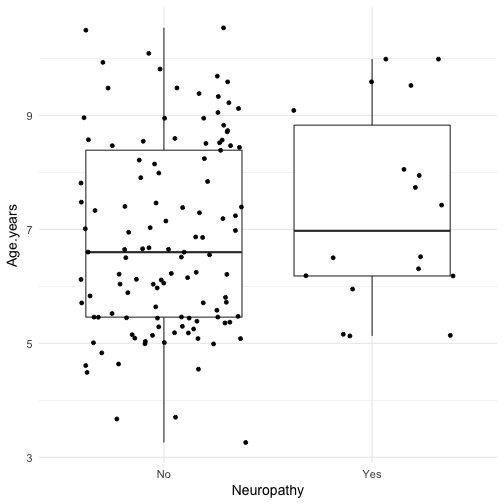
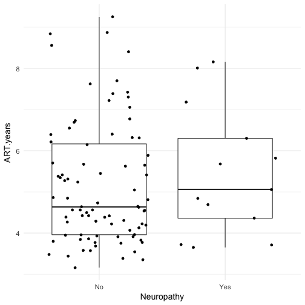

## Quick look

```r
# 'Top-n-tail' data
head(data)
```

```
## # A tibble: 6 × 11
##       ID Neuropathy Neuropathy_pin Age.years    Sex   WAZ   HAZ   CD4
##    <chr>      <chr>          <chr>     <dbl>  <chr> <dbl> <dbl> <int>
## 1 ID8120        Yes            Yes      5.13 Female -2.56 -2.28  1456
## 2 ID8078         No             No      5.47   Male -1.88 -2.31  1465
## 3 ID8076         No             No      6.86 Female -0.82 -1.89  1003
## 4 ID8093         No             No      5.09 Female -0.86 -2.80  1363
## 5 ID8177         No             No      5.25   Male -1.13 -3.12  1264
## 6 ID8190         No             No      5.01 Female  1.29 -0.05  1291
## # ... with 3 more variables: Viral.load <int>, d4T.ever <chr>,
## #   ART.years <dbl>
```

```r
tail(data)
```

```
## # A tibble: 6 × 11
##       ID Neuropathy Neuropathy_pin Age.years    Sex   WAZ   HAZ   CD4
##    <chr>      <chr>          <chr>     <dbl>  <chr> <dbl> <dbl> <int>
## 1 ID8147         No             No      6.11 Female -2.65 -2.76   881
## 2 ID8151        Yes            Yes      7.43   Male -1.11 -1.43   943
## 3 ID8161         No            Yes      5.44   Male -1.24 -0.79   721
## 4 ID8209         No             No      5.81   Male -0.19 -0.91   867
## 5 ID8111        Yes            Yes      6.18   Male -0.77 -1.60  1358
## 6 ID8220         No             No      5.71   Male -2.42 -2.33  1350
## # ... with 3 more variables: Viral.load <int>, d4T.ever <chr>,
## #   ART.years <dbl>
```

```r
# Check structure
glimpse(data)
```

```
## Observations: 135
## Variables: 11
## $ ID             <chr> "ID8120", "ID8078", "ID8076", "ID8093", "ID8177...
## $ Neuropathy     <chr> "Yes", "No", "No", "No", "No", "No", "No", "Yes...
## $ Neuropathy_pin <chr> "Yes", "No", "No", "No", "No", "No", "Yes", "Ye...
## $ Age.years      <dbl> 5.13, 5.47, 6.86, 5.09, 5.25, 5.01, 5.39, 5.16,...
## $ Sex            <chr> "Female", "Male", "Female", "Female", "Male", "...
## $ WAZ            <dbl> -2.56, -1.88, -0.82, -0.86, -1.13, 1.29, 0.46, ...
## $ HAZ            <dbl> -2.28, -2.31, -1.89, -2.80, -3.12, -0.05, -0.71...
## $ CD4            <int> 1456, 1465, 1003, 1363, 1264, 1291, 111, 1397, ...
## $ Viral.load     <int> 189, 20, 20, 798, 20, 20, 20, 20, 20, 20, 21, 2...
## $ d4T.ever       <chr> "Yes", "Yes", "Yes", "Yes", "Yes", "Yes", "Yes"...
## $ ART.years      <dbl> 3.71, 4.22, 5.62, 3.84, 3.91, 3.68, 4.22, 3.65,...
```

****

## Prevalence of HIV-SN (pin-prick)
**Case definition of SN:**  

- _Brief Peripheral Neuropathy Screen (BPNS) + pin-prick_

- _At least one bilateral sign (reduced/absent vibration sense, absent ankle-jerk reflexes, reduced/absent pin-prick)_  

**Case definition of symptomatic SN:** 

- _As above, plus at least one bilateral symptom (pain/aching/burning, tingling/pins-and-needles, numbness)_

### Predictors
**NOTE:** 

- _Predictors for symptomatic SN not explored because of the very small sample size._ 

**Examined:**  

- _Age, sex, height for age, weight for age, CD4 T-cell count, and viral load_

#### Age

```r
# Select data and filter out incomplete cases
age <- data %>%
    select(Age.years, Neuropathy_pin) %>%
    filter(complete.cases(.))

# Plot
qplot(data = age, x = Neuropathy_pin, y = Age.years, 
      geom = c('boxplot', 'jitter')) +
    theme_minimal(base_size = 14) 
```


```r
# Stats
wilcox_test(Age.years ~ factor(Neuropathy_pin), 
            data = age,
            distribution = 'exact',
            conf.int = TRUE)
```

```
## 
## 	Exact Wilcoxon-Mann-Whitney Test
## 
## data:  Age.years by factor(Neuropathy_pin) (No, Yes)
## Z = -1.5714, p-value = 0.1167
## alternative hypothesis: true mu is not equal to 0
## 95 percent confidence interval:
##  -1.20  0.12
## sample estimates:
## difference in location 
##                  -0.55
```

#### Sex

```r
# Select data and filter out incomplete cases
sex <- data %>%
    select(Sex, Neuropathy_pin) %>%
    filter(complete.cases(.)) %>%
    table()

# Plot
mosaicplot(sex,
           cex.axis = 1)
```


```r
# Stats
chisq_test(sex,
           distribution = 'exact')
```

```
## 
## 	Exact Pearson Chi-Squared Test
## 
## data:  Neuropathy_pin by Sex (Female, Male)
## chi-squared = 0.11864, p-value = 0.843
```

#### Height

```r
# Select data and filter out incomplete cases
haz <- data %>%
    select(HAZ, Neuropathy_pin) %>%
    filter(complete.cases(.))

# Plot
qplot(data = haz, x = Neuropathy_pin, y = HAZ, 
      geom = c('boxplot', 'jitter')) +
    theme_minimal(base_size = 14)
```


```r
## Stats
wilcox_test(HAZ ~ factor(Neuropathy_pin),
            data = haz,
            distribution = 'exact',
            conf.int = TRUE)
```

```
## 
## 	Exact Wilcoxon-Mann-Whitney Test
## 
## data:  HAZ by factor(Neuropathy_pin) (No, Yes)
## Z = 0.52666, p-value = 0.6009
## alternative hypothesis: true mu is not equal to 0
## 95 percent confidence interval:
##  -0.28  0.54
## sample estimates:
## difference in location 
##                   0.12
```

#### Age

```r
# Select data and filter out incomplete cases
waz <- data %>%
    select(WAZ, Neuropathy_pin) %>%
    filter(complete.cases(.))

# Plot
qplot(data = waz, x = Neuropathy_pin, y = WAZ, 
      geom = c('boxplot', 'jitter')) +
    theme_minimal(base_size = 14)
```


```r
# Stats
wilcox_test(WAZ ~ factor(Neuropathy_pin),
            data = waz,
            distribution = 'exact',
            conf.int = TRUE)
```

```
## 
## 	Exact Wilcoxon-Mann-Whitney Test
## 
## data:  WAZ by factor(Neuropathy_pin) (No, Yes)
## Z = 1.0432, p-value = 0.299
## alternative hypothesis: true mu is not equal to 0
## 95 percent confidence interval:
##  -0.17  0.56
## sample estimates:
## difference in location 
##                   0.19
```

#### CD4

```r
# Select data and filter out incomplete cases
cd4 <- data %>%
    select(CD4, Neuropathy_pin) %>%
    filter(complete.cases(.))

# Plot
qplot(data = cd4, x = Neuropathy_pin, y = CD4, 
      geom = c('boxplot', 'jitter')) +
    theme_minimal(base_size = 14)
```


```r
## Stats
wilcox_test(CD4 ~ factor(Neuropathy_pin),
            data = cd4,
            distribution = 'exact',
            conf.int = TRUE)
```

```
## 
## 	Exact Wilcoxon-Mann-Whitney Test
## 
## data:  CD4 by factor(Neuropathy_pin) (No, Yes)
## Z = 0.65704, p-value = 0.5137
## alternative hypothesis: true mu is not equal to 0
## 95 percent confidence interval:
##  -92 187
## sample estimates:
## difference in location 
##                   46.5
```

#### Viral load

```r
# Select data and filter out incomplete cases
vl <- data %>%
    select(Viral.load, Neuropathy_pin) %>%
    filter(complete.cases(.)) %>%
    mutate(log10_viral.load = log10(Viral.load))

# Plot
qplot(data = vl, x = Neuropathy_pin, y = log10_viral.load, 
      geom = c('boxplot', 'jitter')) +
    theme_minimal(base_size = 14)
```


```r
# Stats
wilcox_test(log10_viral.load ~ factor(Neuropathy_pin), 
            data = vl, 
            distribution = 'exact',
            conf.int = TRUE)
```

```
## 
## 	Exact Wilcoxon-Mann-Whitney Test
## 
## data:  log10_viral.load by factor(Neuropathy_pin) (No, Yes)
## Z = 0.94789, p-value = 0.3456
## alternative hypothesis: true mu is not equal to 0
## 95 percent confidence interval:
##  0.00000000 0.01539433
## sample estimates:
## difference in location 
##                      0
```

#### D4T use ever

```r
# Select data and filter out incomplete cases
d4t <- data %>%
    select(d4T.ever, Neuropathy_pin) %>%
    filter(complete.cases(.)) %>%
    table()
# Plot
mosaicplot(d4t,
           cex.axis = 1)
```


```r
# Stats
chisq_test(d4t,
           distribution = 'exact',
           conf.int = TRUE)
```

```
## 
## 	Exact Pearson Chi-Squared Test
## 
## data:  Neuropathy_pin by d4T.ever (No, Yes)
## chi-squared = 0.19933, p-value = 1
```

#### ART duration

```r
# Select data and filter out incomplete cases
art.duration <- data %>%
    select(ART.years, Neuropathy_pin) %>%
    filter(complete.cases(.))

# Plot
qplot(data = art.duration, x = Neuropathy_pin, y = ART.years,
      geom = c('boxplot', 'jitter')) +
    theme_minimal(base_size = 14)
```


```r
# Stats
wilcox_test(ART.years ~ factor(Neuropathy_pin),
            data = art.duration,
            distribution = 'exact',
            conf.int = TRUE)
```

```
## 
## 	Exact Wilcoxon-Mann-Whitney Test
## 
## data:  ART.years by factor(Neuropathy_pin) (No, Yes)
## Z = -1.5879, p-value = 0.1131
## alternative hypothesis: true mu is not equal to 0
## 95 percent confidence interval:
##  -1.16  0.12
## sample estimates:
## difference in location 
##                  -0.51
```

****

## Prevalence of HIV-SN (BPNS)
**Case definition of SN:**  

- _Brief Peripheral Neuropathy Screen (BPNS) only_

- _At least one bilateral sign (reduced/absent vibration sense, absent ankle-jerk reflexes)_  

**Case definition of symptomatic SN:** 

- _As above, plus at least one bilateral symptom (pain/aching/burning, tingling/pins-and-needles, numbness)_

### Predictors
**NOTE:** 

- _Predictors for symptomatic SN not explored because of the very small sample size._  

**Examined:**  

- _Age, sex, height for age, weight for age, CD4 T-cell count, and viral load_

#### Age

```r
# Select data and filter out incomplete cases
age <- data %>%
    select(Age.years, Neuropathy) %>%
    filter(complete.cases(.))

# Plot
qplot(data = age, x = Neuropathy, y = Age.years, 
      geom = c('boxplot', 'jitter')) +
    theme_minimal(base_size = 14)
```



```r
# Stats
wilcox_test(Age.years ~ factor(Neuropathy), 
            data = age,
            distribution = 'exact',
            conf.int = TRUE)
```

```
## 
## 	Exact Wilcoxon-Mann-Whitney Test
## 
## data:  Age.years by factor(Neuropathy) (No, Yes)
## Z = -1.2137, p-value = 0.2275
## alternative hypothesis: true mu is not equal to 0
## 95 percent confidence interval:
##  -1.32  0.33
## sample estimates:
## difference in location 
##                 -0.545
```

#### Sex

```r
# Select data and filter out incomplete cases
sex <- data %>%
    select(Sex, Neuropathy) %>%
    filter(complete.cases(.)) %>%
    table()

# Plot
mosaicplot(sex,
           cex.axis = 1)
```


```r
# Stats
chisq_test(sex,
           distribution = 'exact')
```

```
## 
## 	Exact Pearson Chi-Squared Test
## 
## data:  Neuropathy by Sex (Female, Male)
## chi-squared = 0.50481, p-value = 0.6135
```

#### Height

```r
# Select data and filter out incomplete cases
haz <- data %>%
    select(HAZ, Neuropathy) %>%
    filter(complete.cases(.))

# Plot
qplot(data = haz, x = Neuropathy, y = HAZ, 
      geom = c('boxplot', 'jitter')) +
    theme_minimal(base_size = 14)
```


```r
## Stats
wilcox_test(HAZ ~ factor(Neuropathy),
            data = haz,
            distribution = 'exact',
            conf.int = TRUE)
```

```
## 
## 	Exact Wilcoxon-Mann-Whitney Test
## 
## data:  HAZ by factor(Neuropathy) (No, Yes)
## Z = 0.75688, p-value = 0.4533
## alternative hypothesis: true mu is not equal to 0
## 95 percent confidence interval:
##  -0.28  0.66
## sample estimates:
## difference in location 
##                   0.18
```

#### Age

```r
# Select data and filter out incomplete cases
waz <- data %>%
    select(WAZ, Neuropathy) %>%
    filter(complete.cases(.))

# Plot
qplot(data = waz, x = Neuropathy, y = WAZ, 
      geom = c('boxplot', 'jitter')) +
    theme_minimal(base_size = 14)
```


```r
# Stats
wilcox_test(WAZ ~ factor(Neuropathy),
            data = waz,
            distribution = 'exact',
            conf.int = TRUE)
```

```
## 
## 	Exact Wilcoxon-Mann-Whitney Test
## 
## data:  WAZ by factor(Neuropathy) (No, Yes)
## Z = 1.7052, p-value = 0.08857
## alternative hypothesis: true mu is not equal to 0
## 95 percent confidence interval:
##  -0.05  0.85
## sample estimates:
## difference in location 
##                   0.36
```

#### CD4

```r
# Select data and filter out incomplete cases
cd4 <- data %>%
    select(CD4, Neuropathy) %>%
    filter(complete.cases(.))

# Plot
qplot(data = cd4, x = Neuropathy, y = CD4, 
      geom = c('boxplot', 'jitter')) +
    theme_minimal(base_size = 14)
```


```r
## Stats
wilcox_test(CD4 ~ factor(Neuropathy),
            data = cd4,
            distribution = 'exact',
            conf.int = TRUE)
```

```
## 
## 	Exact Wilcoxon-Mann-Whitney Test
## 
## data:  CD4 by factor(Neuropathy) (No, Yes)
## Z = 0.1044, p-value = 0.9189
## alternative hypothesis: true mu is not equal to 0
## 95 percent confidence interval:
##  -156  187
## sample estimates:
## difference in location 
##                      9
```

#### Viral load

```r
# Select data and filter out incomplete cases
vl <- data %>%
    select(Viral.load, Neuropathy) %>%
    filter(complete.cases(.)) %>%
    mutate(log10_viral.load = log10(Viral.load))

# Plot
qplot(data = vl, x = Neuropathy, y = log10_viral.load, 
      geom = c('boxplot', 'jitter')) +
    theme_minimal(base_size = 14)
```


```r
# Stats
wilcox_test(log10_viral.load ~ factor(Neuropathy), 
            data = vl, 
            distribution = 'exact',
            conf.int = TRUE)
```

```
## 
## 	Exact Wilcoxon-Mann-Whitney Test
## 
## data:  log10_viral.load by factor(Neuropathy) (No, Yes)
## Z = -0.081346, p-value = 0.9372
## alternative hypothesis: true mu is not equal to 0
## 95 percent confidence interval:
##  0 0
## sample estimates:
## difference in location 
##                      0
```

#### D4T use ever

```r
# Select data and filter out incomplete cases
d4t <- data %>%
    select(d4T.ever, Neuropathy) %>%
    filter(complete.cases(.)) %>%
    table()

# Plot
mosaicplot(d4t,
           cex.axis = 1)
```


```r
# Stats
chisq_test(d4t,
           distribution = 'exact',
           conf.int = TRUE) 
```

```
## 
## 	Exact Pearson Chi-Squared Test
## 
## data:  Neuropathy by d4T.ever (No, Yes)
## chi-squared = 0.9835, p-value = 0.5971
```

#### ART duration

```r
# Select data and filter out incomplete cases
art.duration <- data %>%
    select(ART.years, Neuropathy) %>%
    filter(complete.cases(.))

# Plot
qplot(data = art.duration, x = Neuropathy, y = ART.years,
      geom = c('boxplot', 'jitter')) +
    theme_minimal(base_size = 14)
```



```r
# Stats
wilcox_test(ART.years ~ factor(Neuropathy),
            data = art.duration,
            distribution = 'exact',
            conf.int = TRUE)
```

```
## 
## 	Exact Wilcoxon-Mann-Whitney Test
## 
## data:  ART.years by factor(Neuropathy) (No, Yes)
## Z = -0.68833, p-value = 0.4973
## alternative hypothesis: true mu is not equal to 0
## 95 percent confidence interval:
##  -1.19  0.55
## sample estimates:
## difference in location 
##                   -0.3
```

****

## Session infomation
**R version 3.3.3 (2017-03-06)**

**Platform:** x86_64-apple-darwin13.4.0 (64-bit) 

**locale:**
en_GB.UTF-8||en_GB.UTF-8||en_GB.UTF-8||C||en_GB.UTF-8||en_GB.UTF-8

**attached base packages:** 
_methods_, _stats_, _graphics_, _grDevices_, _utils_, _datasets_ and _base_

**other attached packages:** 
_pander(v.0.6.0)_, _coin(v.1.1-3)_, _survival(v.2.41-3)_, _ggplot2(v.2.2.1)_, _readr(v.1.1.0)_, _tidyr(v.0.6.1)_ and _dplyr(v.0.5.0)_

**loaded via a namespace (and not attached):** 
_Rcpp(v.0.12.10)_, _highr(v.0.6)_, _plyr(v.1.8.4)_, _R.methodsS3(v.1.7.1)_, _R.utils(v.2.5.0)_, _tools(v.3.3.3)_, _digest(v.0.6.12)_, _packrat(v.0.4.8-1)_, _evaluate(v.0.10)_, _tibble(v.1.3.0)_, _gtable(v.0.2.0)_, _lattice(v.0.20-35)_, _Matrix(v.1.2-8)_, _DBI(v.0.6-1)_, _mvtnorm(v.1.0-6)_, _ezknitr(v.0.6)_, _stringr(v.1.2.0)_, _knitr(v.1.15.1)_, _hms(v.0.3)_, _stats4(v.3.3.3)_, _grid(v.3.3.3)_, _R6(v.2.2.0)_, _multcomp(v.1.4-6)_, _TH.data(v.1.0-8)_, _magrittr(v.1.5)_, _scales(v.0.4.1)_, _codetools(v.0.2-15)_, _modeltools(v.0.2-21)_, _splines(v.3.3.3)_, _MASS(v.7.3-45)_, _assertthat(v.0.2.0)_, _colorspace(v.1.3-2)_, _labeling(v.0.3)_, _sandwich(v.2.3-4)_, _stringi(v.1.1.5)_, _lazyeval(v.0.2.0)_, _munsell(v.0.4.3)_, _zoo(v.1.8-0)_ and _R.oo(v.1.21.0)_

